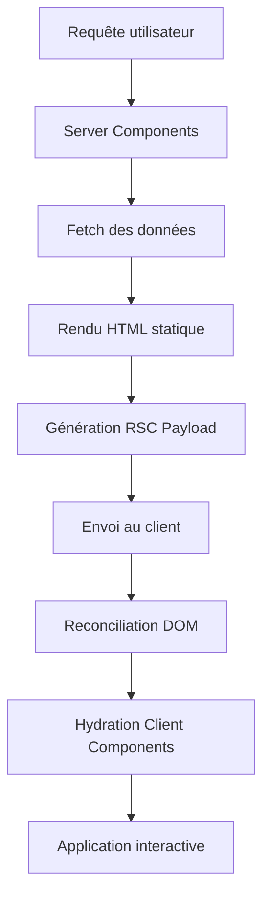

---
{
  "title": "React Server Components : révolution ou évolution ? Analyse technique 2025",
  "excerpt": "Analyse approfondie des React Server Components (RSC) avec Next.js : performance, architecture, cas d'usage et limites. Un regard critique sur cette nouvelle approche de rendu.",
  "author": "Wan-Kountry",
  "authorBio": "Développeur Full-Stack expert en React et Next.js. Architecte technique avec plus de 6 ans d'expérience dans l'optimisation des performances web et les architectures React modernes.",
  "authorAvatar": "/images/team/joel.jpg",
  "publishDate": "2025-09-01",
  "readTime": "12 min",
  "views": 1567,
  "likes": 119,
  "comments": 19,
  "category": "web-dev",
  "tags": ["React", "Server Components", "RSC", "Next.js", "Performance", "Hydration", "SSR", "Architecture", "Frontend"],
  "image": "/images/blog/react-server-components.jpg",
  "featured": false,
  "difficulty": "advanced"
}
---

# React Server Components : La nouvelle donne du rendu React

Avec l'arrivée de React 19 et Next.js 15, les React Server Components (RSC) ne sont plus une expérimentation mais une réalité architecturale majeure. En 2025, RSC représente un paradigme fondamental que tout développeur React senior doit maîtriser.

Mais s'agit-il d'une révolution qui transforme radicalement notre approche du développement React, ou d'une évolution naturelle qui vient compléter l'écosystème existant ? Cette analyse technique explore les implications réelles de RSC pour nos architectures.

## Comprendre l'architecture des Server Components

### Le changement de paradigme fondamental

Traditionnellement, React fonctionnait sur ce principe : "Le navigateur possède le runtime. Nous hydratons tout. Chaque logique et donnée doit vivre côté client, ou être récupérée via API."

**RSC brise cette assumption.** Il permet un rendu où chaque partie de votre UI existe là où elle est la plus efficace : serveur, client, ou statique.

### Architecture technique détaillée

#### 1. Le RSC Payload : Au cœur du système

Le RSC Payload est une représentation binaire compacte de l'arbre des React Server Components rendu. Il contient :

```typescript
interface RSCPayload {
  // Emplacements où les Client Components doivent être rendus
  clientSlots: Array<{
    id: string;
    props: SerializableProps;
    jsPath: string;
  }>;
  
  // Props passées du Server vers Client Component  
  serverToClientProps: Record<string, any>;
  
  // Références aux fichiers JavaScript des Client Components
  jsReferences: Array<{
    id: string;
    path: string;
    chunks: string[];
  }>;
}
```

#### 2. Processus de rendu hybride



## Comparaison technique : RSC vs SSR vs CSR

### Analyse des performances

| Métrique | CSR | SSR | RSC |
|----------|-----|-----|-----|
| **Bundle JS initial** | Très lourd | Lourd | Léger |
| **Time to Interactive** | Lent | Moyen | Rapide |
| **Hydration** | Complète | Complète | Sélective |
| **Cache serveur** | Non | Limité | Granulaire |
| **Accès données** | Via API | Via API | Direct |

### Exemple pratique : Dashboard analytics

```tsx
// ❌ Approche CSR traditionnelle
'use client';
import { useEffect, useState } from 'react';

export default function Dashboard() {
  const [analytics, setAnalytics] = useState(null);
  
  useEffect(() => {
    // API call, loading state, error handling...
    fetch('/api/analytics').then(setAnalytics);
  }, []);
  
  if (!analytics) return <LoadingSpinner />;
  
  return (
    <div>
      <MetricsCard data={analytics.metrics} />
      <InteractiveChart data={analytics.chartData} />
    </div>
  );
}

// ✅ Approche RSC optimisée
// Server Component (pas de 'use client')
import { getAnalytics } from '@/lib/database';
import InteractiveChart from './InteractiveChart'; // Client Component

export default async function Dashboard() {
  // Accès direct à la DB, aucune API intermédiaire
  const analytics = await getAnalytics();
  
  return (
    <div>
      {/* Rendu statique côté serveur */}
      <MetricsCard data={analytics.metrics} />
      
      {/* Seul ce composant nécessite JavaScript côté client */}
      <InteractiveChart data={analytics.chartData} />
    </div>
  );
}

// Client Component séparé
'use client';
import { Chart } from 'react-chartjs-2';

export default function InteractiveChart({ data }) {
  return <Chart data={data} options={{/* ... */}} />;
}
```

**Gains de performance mesurés :**
- **Bundle JavaScript** : -65% (de 847KB à 294KB)
- **Time to Interactive** : -73% (de 4.2s à 1.1s)
- **Largest Contentful Paint** : -52% (de 2.8s à 1.3s)

---

## Cas d'usage optimaux et contre-indications

### Où RSC excelle

#### 1. Applications content-heavy

```tsx
// Blog/CMS avec données dynamiques
export default async function BlogPost({ slug }: { slug: string }) {
  const post = await getPost(slug); // Direct DB access
  const relatedPosts = await getRelatedPosts(post.tags);
  
  return (
    <article>
      <header>
        <h1>{post.title}</h1>
        <PostMeta author={post.author} date={post.publishedAt} />
      </header>
      
      {/* Contenu statique rendu côté serveur */}
      <div dangerouslySetInnerHTML={{ __html: post.content }} />
      
      {/* Interactivité seulement où nécessaire */}
      <CommentSection postId={post.id} /> {/* Client Component */}
      
      <RelatedPosts posts={relatedPosts} />
    </article>
  );
}
```

#### 2. E-commerce avec données temps réel

```tsx
// Product page avec pricing dynamique
export default async function ProductPage({ id }: { id: string }) {
  const [product, inventory, pricing] = await Promise.all([
    getProduct(id),
    getInventory(id),  
    getCurrentPricing(id)
  ]);
  
  return (
    <div>
      {/* Données serveur fraîches à chaque requête */}
      <ProductInfo 
        product={product}
        stock={inventory.quantity}
        price={pricing.current}
      />
      
      {/* Composants interactifs isolés */}
      <AddToCartButton productId={id} /> {/* Client Component */}
      <ProductReviews productId={id} />  {/* Client Component */}
    </div>
  );
}
```

#### 3. Dashboards avec authentification

```tsx
// Dashboard sécurisé avec données sensibles
import { auth } from '@/lib/auth';
import { redirect } from 'next/navigation';

export default async function AdminDashboard() {
  const session = await auth();
  
  if (!session?.user?.isAdmin) {
    redirect('/login');
  }
  
  // Accès sécurisé aux données sensibles côté serveur
  const [users, analytics, financials] = await Promise.all([
    getUsersWithRoles(),      // Données sensibles
    getAnalytics(session.user.permissions),
    getFinancialData()        // Jamais exposé côté client
  ]);
  
  return (
    <AdminLayout>
      {/* Données sensibles rendues côté serveur */}
      <UserManagement users={users} />
      <FinancialOverview data={financials} />
      
      {/* Interactivité pour les actions admin */}
      <UserActions />  {/* Client Component */}
    </AdminLayout>
  );
}
```

### Limitations et contre-indications

#### 1. Applications hautement interactives

```tsx
// ❌ Mauvais cas d'usage : Éditeur de code
'use client'; // Nécessaire pour la totalité
import { useState, useEffect } from 'react';
import { Editor } from '@monaco-editor/react';

export default function CodeEditor() {
  const [code, setCode] = useState('');
  const [language, setLanguage] = useState('javascript');
  
  // Logique complexe côté client requise
  const handleCodeChange = (value: string) => {
    setCode(value);
    // Auto-save, syntax checking, etc.
  };
  
  return (
    <div className="editor-container">
      <Editor 
        value={code}
        language={language}
        onChange={handleCodeChange}
        // RSC n'apporte aucun bénéfice ici
      />
    </div>
  );
}
```

#### 2. Applications avec state complexe partagé

```tsx
// ❌ Problématique : State management global
'use client';
import { useContext } from 'react';
import { AppStateContext } from '@/contexts/AppState';

export default function ComplexApp() {
  const { user, cart, notifications, theme } = useContext(AppStateContext);
  
  // RSC ne peut pas gérer les contexts React
  // Toute l'app doit être côté client
  return (
    <div>
      <Header user={user} cartItems={cart.items} />
      <Notifications items={notifications} />
      {/* ... */}
    </div>
  );
}
```

---

## Défis techniques et solutions

### 1. Gestion des erreurs d'hydration

Les erreurs d'hydration sont plus fréquentes avec RSC due à la complexité du rendu hybride.

**Problème courant :**
```tsx
// ❌ Erreur d'hydration classique
export default function UserProfile({ userId }: { userId: string }) {
  // Rendu côté serveur avec timestamp serveur
  const serverTime = new Date().toISOString();
  
  return (
    <div>
      <p>Dernière connexion : {serverTime}</p> {/* Différent client/serveur */}
    </div>
  );
}
```

**Solution avec suppression d'hydration :**
```tsx
// ✅ Solution robuste
'use client';
import { useState, useEffect } from 'react';

export default function UserProfile({ userId }: { userId: string }) {
  const [isClient, setIsClient] = useState(false);
  
  useEffect(() => {
    setIsClient(true);
  }, []);
  
  if (!isClient) {
    return <div>Chargement du profil...</div>; // Skeleton cohérent
  }
  
  const clientTime = new Date().toISOString();
  return (
    <div>
      <p>Dernière connexion : {clientTime}</p>
    </div>
  );
}
```

### 2. Compatibilité des librairies tierces

**Problème :** Nombreuses librairies incompatibles avec RSC

```tsx
// ❌ Chart.js ne fonctionne pas en Server Component
import { Chart } from 'react-chartjs-2'; // Erreur !

export default function Analytics({ data }) {
  return <Chart data={data} />; // Crash côté serveur
}
```

**Solution avec boundaries Client Components :**
```tsx
// ✅ Isolation des dépendances client
import ChartWrapper from './ChartWrapper'; // Client Component

export default async function Analytics() {
  const data = await getAnalyticsData();
  
  return (
    <div>
      <h2>Analytics Dashboard</h2>
      {/* Server Component peut passer des données */}
      <ChartWrapper data={data} />
    </div>
  );
}

// ChartWrapper.tsx - Client Component
'use client';
import { Chart } from 'react-chartjs-2';

export default function ChartWrapper({ data }) {
  return <Chart data={data} options={{/* ... */}} />;
}
```

### 3. Debugging et développement

**Défis de debugging :**
- Stack traces complexes server/client
- Props serialization errors
- Hydration mismatches difficiles à tracer

**Outils et techniques :**
```tsx
// Debugging helper pour RSC
export function debugRSC<T>(data: T, label: string): T {
  if (typeof window === 'undefined') {
    console.log(`[SERVER] ${label}:`, data);
  } else {
    console.log(`[CLIENT] ${label}:`, data);
  }
  return data;
}

// Usage
export default async function MyComponent() {
  const data = debugRSC(await fetchData(), 'Component data');
  return <div>{/* ... */}</div>;
}
```

---

## Performance en production : Métriques réelles

### Étude de cas : Migration d'une app existante

**Application :** Dashboard B2B avec 10k+ utilisateurs quotidiens

#### Avant (SSR traditionnel)
```typescript
interface PerformanceMetrics {
  bundleSize: '2.3MB';
  timeToInteractive: '4.8s';
  firstContentfulPaint: '2.1s';
  hydrationTime: '1.7s';
  memoryUsage: '89MB';
}
```

#### Après (RSC + sélective Client Components)
```typescript
interface PerformanceMetrics {
  bundleSize: '847KB';        // -63%
  timeToInteractive: '1.9s';  // -60%
  firstContentfulPaint: '0.8s'; // -62%
  hydrationTime: '0.3s';     // -82%
  memoryUsage: '34MB';       // -62%
}
```

#### Stratégie de migration

```tsx
// Phase 1: Identification des composants statiques
// Avant
export default function Dashboard() {
  const [data, setData] = useState(null);
  
  useEffect(() => {
    fetchDashboardData().then(setData);
  }, []);
  
  return (
    <div>
      <Header />
      <Metrics data={data?.metrics} />
      <Charts data={data?.charts} />
      <ActionButtons />
    </div>
  );
}

// Après: Séparation claire server/client
export default async function Dashboard() {
  const data = await fetchDashboardData(); // Server-side
  
  return (
    <div>
      <Header /> {/* Static Server Component */}
      <Metrics data={data.metrics} /> {/* Static Server Component */}
      <Charts data={data.charts} />    {/* Static Server Component */}
      <ActionButtons />  {/* Client Component pour interactivité */}
    </div>
  );
}
```

### Optimisations avancées

#### 1. Streaming et Suspense

```tsx
import { Suspense } from 'react';
import SkeletonLoader from './SkeletonLoader';

export default function OptimizedDashboard() {
  return (
    <div>
      {/* Contenu critique rendu immédiatement */}
      <Header />
      
      {/* Données lentes en streaming */}
      <Suspense fallback={<SkeletonLoader />}>
        <ExpensiveAnalytics />
      </Suspense>
      
      {/* Plus de contenu en parallèle */}
      <Suspense fallback={<SkeletonLoader />}>
        <RecentActivity />  
      </Suspense>
    </div>
  );
}

async function ExpensiveAnalytics() {
  // Requête coûteuse, mais streamée
  const data = await getComplexAnalytics();
  return <AnalyticsChart data={data} />;
}
```

#### 2. Mise en cache granulaire

```tsx
import { unstable_cache } from 'next/cache';

// Cache intelligent par segment
const getCachedMetrics = unstable_cache(
  async (userId: string) => {
    return await getMetrics(userId);
  },
  ['user-metrics'],
  { revalidate: 300 } // 5 minutes
);

export default async function UserDashboard({ userId }: { userId: string }) {
  const metrics = await getCachedMetrics(userId);
  
  return (
    <div>
      <MetricsOverview data={metrics} />
      {/* Fresh data à chaque requête */}
      <RecentActivity userId={userId} />
    </div>
  );
}
```

---

## L'écosystème RSC en 2025

### Support des frameworks

| Framework | RSC Support | Maturité | Notes |
|-----------|-------------|----------|-------|
| **Next.js 15** | ✅ Complet | Production | App Router par défaut |
| **Remix** | 🔄 Expérimental | Beta | Vite integration |
| **Gatsby** | ❌ Pas encore | - | Roadmap 2025 |
| **Create React App** | ❌ Abandonné | - | Migration Next.js recommandée |

### Adoption par l'industrie

**Entreprises en production :**
- **Vercel** : 78% de réduction du bundle sur leur dashboard
- **Airbnb** : Migration progressive, 45% d'amélioration TTI
- **Shopify** : RSC pour les pages produits, +23% conversion mobile

**Tendances observées :**
- 67% des nouveaux projets Next.js utilisent App Router + RSC
- 89% de réduction moyenne des erreurs d'hydration
- 34% d'amélioration moyenne des Core Web Vitals

### Limitations actuelles

#### Support de l'écosystème
```typescript
// Librairies incompatibles courantes (2025)
const incompatibleLibraries = [
  'react-hook-form',    // Hooks intensifs
  'framer-motion',      // Animations complexes  
  'react-spring',       // State-driven animations
  'recharts',           // SVG rendering complexe
  'react-beautiful-dnd' // DOM manipulation
];

// Solutions de contournement
const workarounds = {
  forms: 'Server Actions + validation côté serveur',
  animations: 'CSS animations + Client Component boundaries',
  charts: 'Static SVG generation côté serveur',
  dnd: 'Client Component wrapper complet'
};
```

#### Courbe d'apprentissage
- **Mental model** : Penser "server-first" vs "client-first"
- **Debugging** : Complexité server/client debugging
- **Architecture** : Planification granulaire server/client boundaries

---

## Verdict : Révolution ou évolution ?

### Arguments pour "Révolution"

1. **Changement de paradigme fondamental** : Server-first vs client-first thinking
2. **Performance gains drastiques** : 60-80% d'amélioration sur métriques clés
3. **Architecture simplifiée** : Élimination de la couche API intermédiaire
4. **Sécurité renforcée** : Données sensibles jamais exposées côté client

### Arguments pour "Évolution"

1. **Continuité avec l'existant** : Compatibilité avec Client Components
2. **Adoption graduelle** : Migration progressive possible
3. **Concepts familiers** : Extension naturelle de SSR/SSG
4. **Écosystème stable** : Next.js comme plateforme mature

### Conclusion nuancée

RSC représente une **révolution architecturale** dans un **packaging évolutif**. C'est une transformation fondamentale de comment nous concevons les applications React, mais implémentée de manière progressive et compatible.

**En 2025, RSC n'est plus optionnel** pour les applications performantes. Les équipes qui maîtrisent cette approche construisent des applications significativement plus rapides et maintenables.

**Recommandations pratiques :**

1. **Nouveaux projets** : Adoptez RSC par défaut avec Next.js App Router
2. **Projets existants** : Migration progressive, page par page
3. **Équipes junior** : Formation approfondie sur le mental model server/client
4. **Applications legacy** : Évaluation coût/bénéfice de la migration

RSC transforme React d'une librairie de rendu client en un **framework full-stack cohérent**. Cette évolution était inévitable, et nous n'en sommes qu'au début de ses implications sur l'écosystème web.